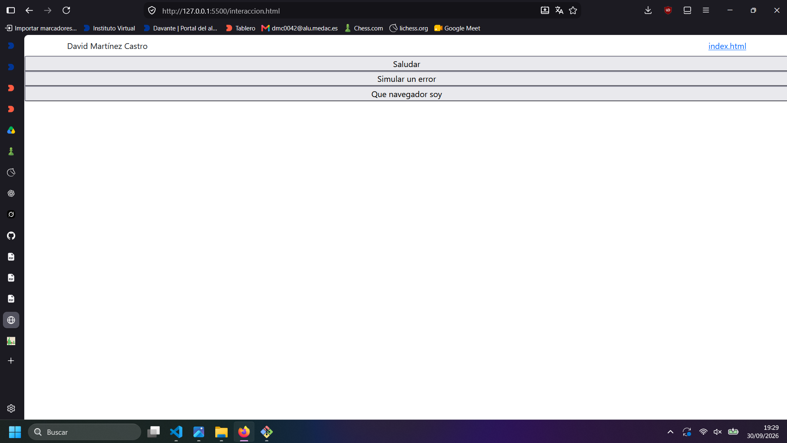
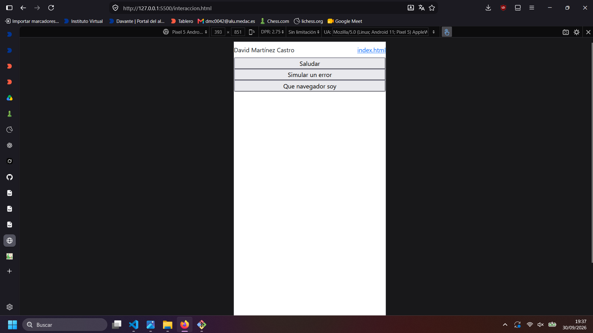
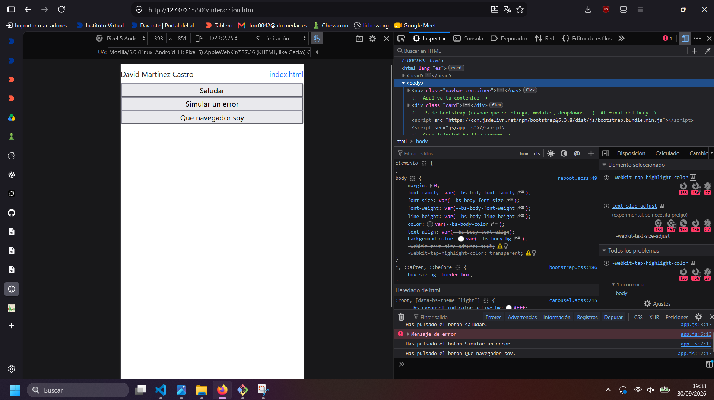
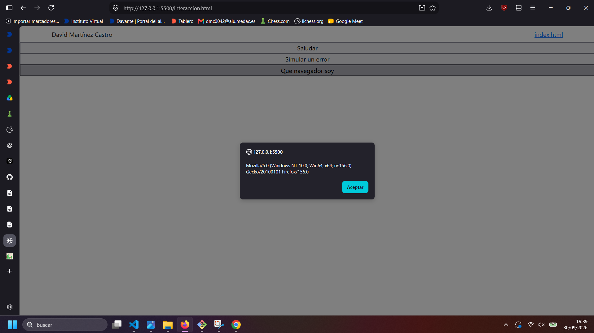
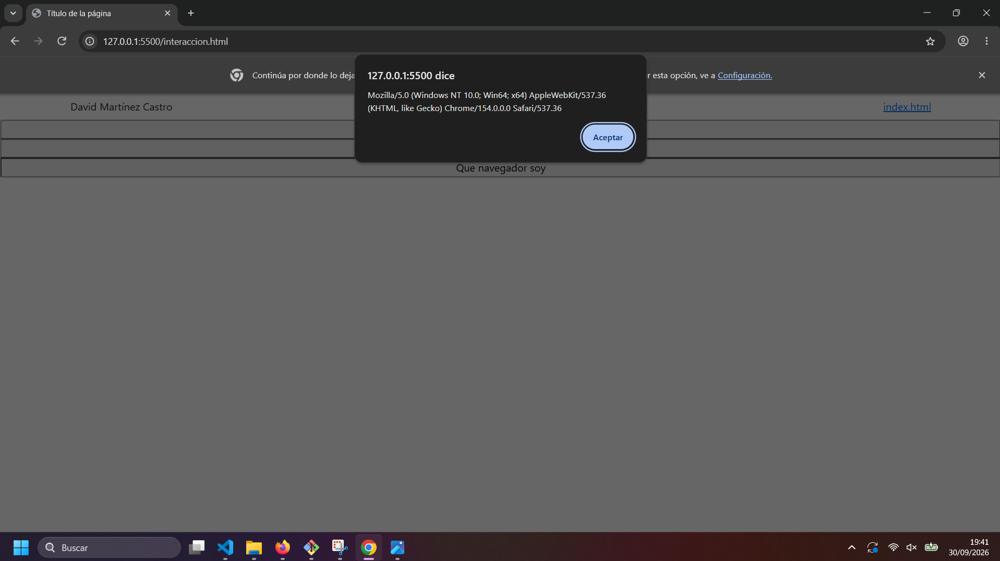
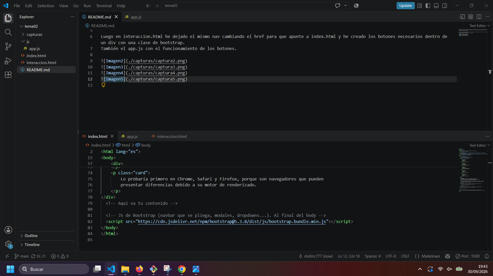

#1 Capturas y explicacion:

En index he creado un nav con una clase de bootstrap, con mi nombre y un enlace que lleva a interaccion.html.
Luego una tabla con lo que se pedia en el ejercicio con otra clase de bootstrap y al final dos parrafos con la clase card.
También he usado container, row y col-.

Luego en interaccion.html he dejado el mismo nav cambiando el href para que apunte a index.html y he creado los botones necesarios dentro de un div con row. 
También el app.js con el funcionamiento de los botones.

2# Explicación botones:

El boton saludar: 
<button id="boton1">Saludar</button>
Bootstrap lo presenta como una card junto con el resto de botones debido a que estan todos dentro de un div con la clase row.
Mediante el uso de onclick se llama a la funcion de app.js para que cuando lo pulses salte una alerta con mi nombre y un log por consola.

#3 Comparación userAgent:
    1-Firefox:
    Mozilla/5.0 (Windows NT 10.0; Win64; x64; rv:156.0) Gecko/20100101 Firefox/156.0

    2-Chrome:
    Mozilla/5.0 (Windows NT 10.0; Win64; x64) AppleWebKit/537.36 (KHTML, like Gecko) Chrome/154.0.0.0 Safari/537.36

Se indica que usas windows, varios motores de navegación y numeros de versión, aparentemente se usan por razones históricas o de compatibilidad, no por que usen ese motor como se puede observar en el caso de Chrome(AppleWebKit).

4# Fuentes consultadas:
Chat gpt, grok y claude: para uso de bootstrap, js, e información sobre los navegadores y motores.