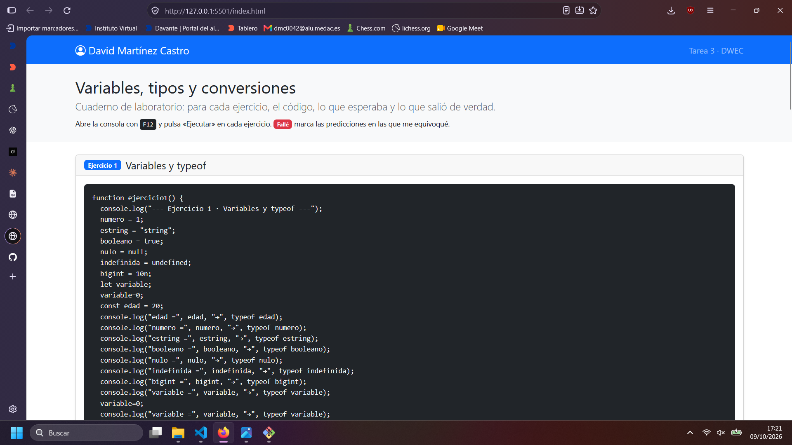
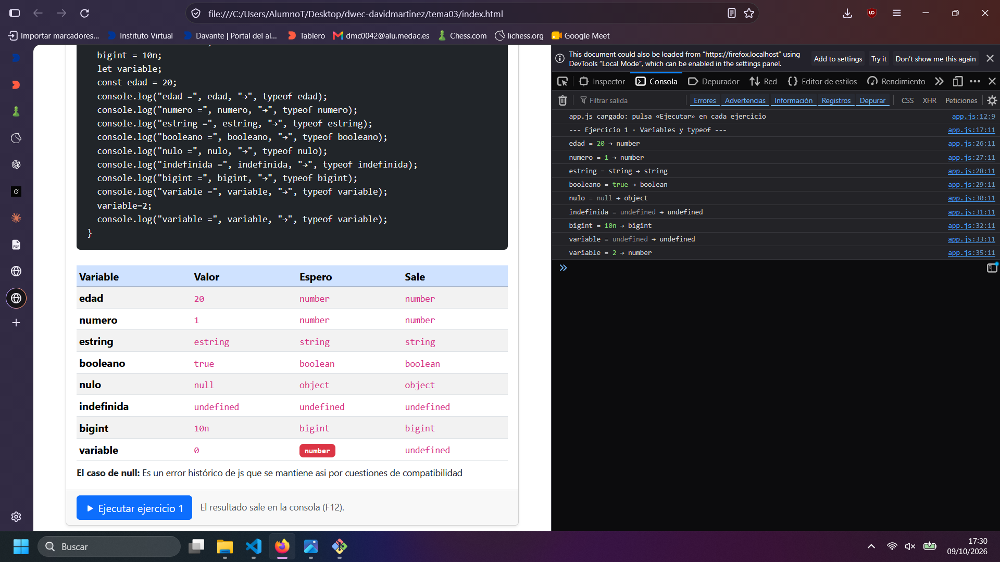
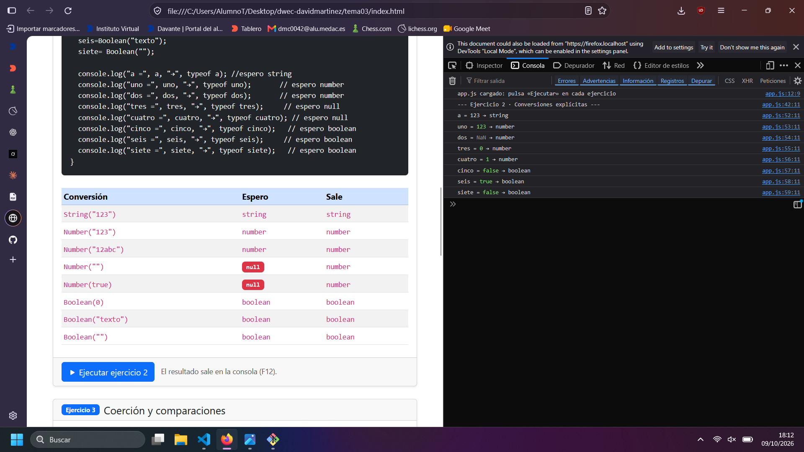
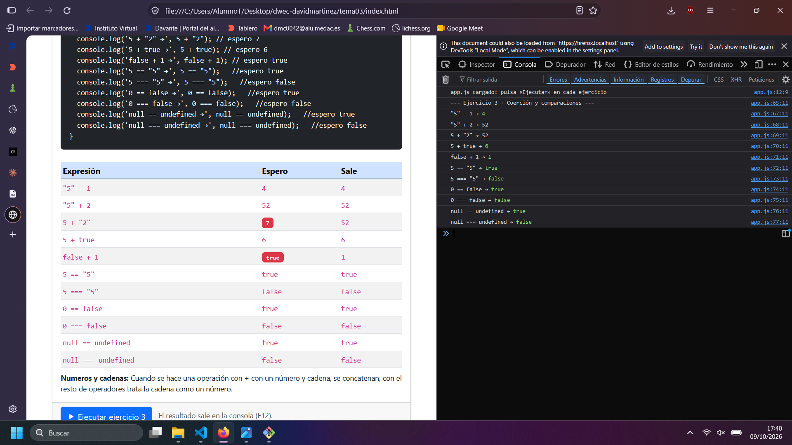
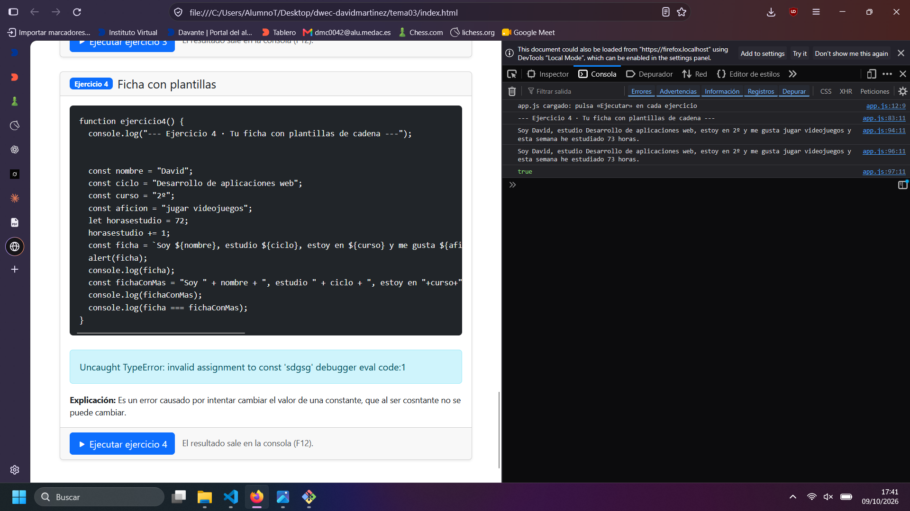

# Tarea 3 · Variables, tipos y conversiones

**Autor:** David Martínez Castro · Desarrollo Web en Entorno Cliente (DWEC) · 2.º DAW · Curso 2026-27

En esta carpeta está el html, el js, capturas y readme, para ver la página se puede hacer mediante live server o abriendo el archivo. Para los console log con f12 despueés de pulsar ejecutar en el ejercicio correspondiente.

## Capturas

### a) La página entera

Se ve el navbar con mi nombre, el nombre de la tarea y abreviación de asignatura, cabecera con información de la práctica y el comienzo del primer ejercicio.

### b) Consola del ejercicio 1

Se ven los console logs y la tabla de lo que espero / lo que sale.

### c) Consola del ejercicio 2

Se ve la consola con los typeof de las variables de js y la tabla y código del ejercicio 2.

### d) Consola del ejercicio 3

Se ve el resultado de las distintas operaciones realizadas en js junto con la tabla.

### e) Consola del ejercicio 4, con el error de la const

Se ve el console log de la misma cadena hecha de dos maneras y el resultado de su comparación con ===.

## Reflexión

Me parecieron las más intuitivas las que empiezan con string como "5" + 2, ya que esperaba que saliese 52, pero en cambio las que empiezan con un número y se le añade un string como en el caso de 5 + "2", pensaba que se trataría el string como un número y me sorprendió mucho.

Luego los booleanos me parecieron bastante intuitivos porque al ser o 0 o 1 es más intuitivo a excepción del false + 1 que también me pareció sorprendente.

## Fuentes

- [ChatGPT](https://chatgpt.com)https://claude.ai
- [Claude](https://claude.ai)
## Uso de IA

ChatGPT, Claude: explicacion typeof null, explicación cuando mandan cadenas o no, modificación de las tablas(rellenarlas partiendo con el código de js) y console logs (crearlos con el mismo formato a partir de las variables que le pasé).
